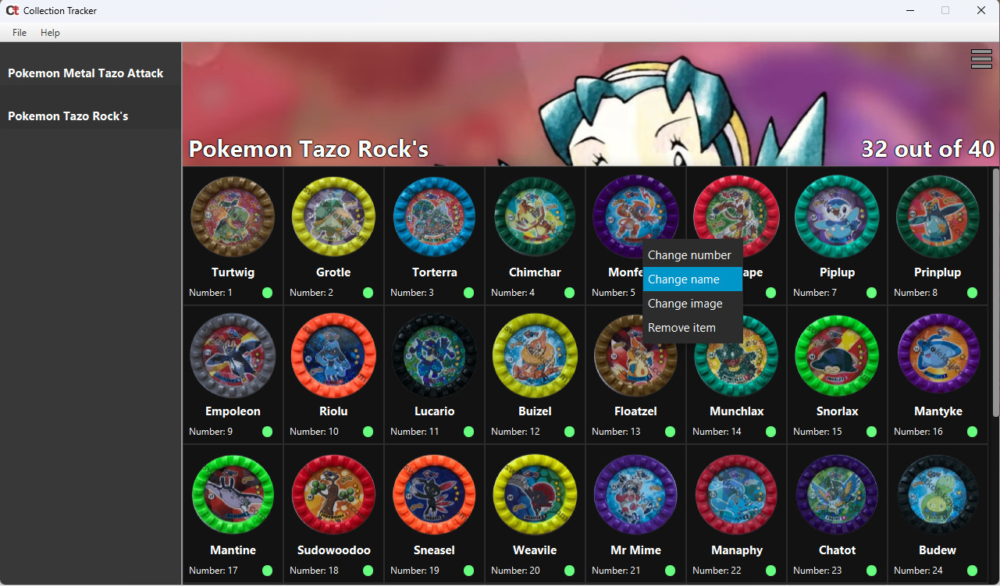

<h1 align="center">
  <br>
 
  <br>
  Collection Tracker
  <br>
</h1>

<h4 align="center">A simple JavaFX app for hobbyists to organize, share and manage their personal collections efficiently.</h4>
<p align="center">
	<a href="#description">Description</a> •
  <a href="#key-features">Key Features</a> •
  <a href="#requirements">Requirements</a> •
  <a href="#how-to-use">How To Use</a> •
  <a href="#credits">Credits</a> 
	
</p>


## Description
Collection Tracker is a JavaFX application designed for hobbyists and collectors who want to organize and manage their personal collections efficiently. Whether you collect stamps, coins, action figures, or anything else, this app aims to simplify the process of keeping track of your items, their details, and the overall status of your collection.

<strong> Collection Tracker is not intended for commercial use purposes. This is my first project in JavaFX, and it was made to get to know the framework and for fun.
 I'll be using it though! </strong>

## Key Features

* Collection creation - create your own collection with background, name as you please
  - Choose image file, and it'll automatically generate a collection file in the chosen path.
 * Item adding - select a file, name and number
* Edit item possession status
  - If you have the item, just click the checkbox!
*  Switch between collections
	  - Load more collections and switch as you'd like.
* Edit details
	  - You can customize anything, anytime -  from images to name and numbers.
* Share collection
	  - Share collection with people like you. Just give them a collection file.
	  - Or generate new non-selected collection using context menu so your friends can select what they own!
## Requirements
* At least 1280x720 (HD) resolution screen
* JDK 17
## How To Use

To clone the repo use
```
git clone https://github.com/Misiac/Collection-Tracker.git
```
You can use it via your IDE,
download the jar from releases section, or build your own with
```
mvn install
```
Create your first own collection, by toggling the creation mode in menu bar

## Credits
https://swiatkolekcji.com/ - for images on screenshot
